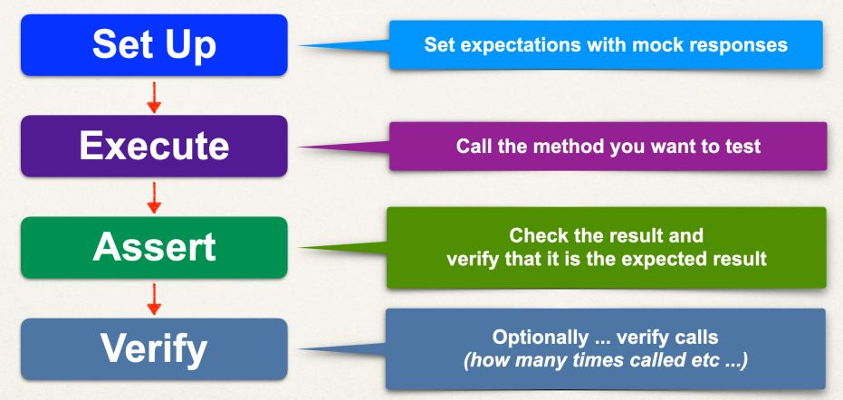
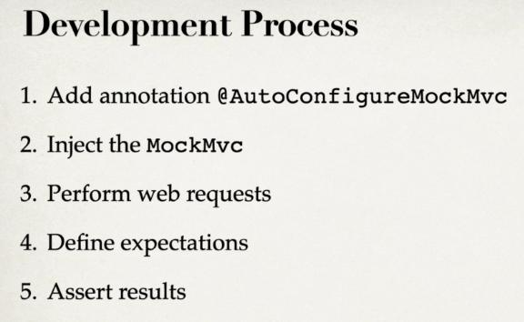
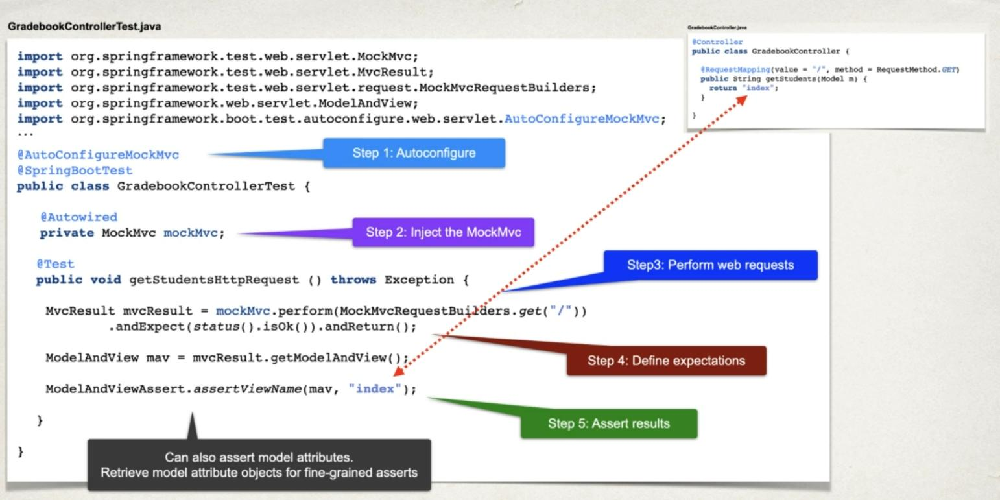

# Spring Boot Unit Testing with JUnit, Mockito and MockMvc
## 01- JUnit Review:
###  In 1.0_junitDemo project:
#### Create the DemoUtilsTest class
1. Junit Assertions::  assertEquals, assertNotEquals, assertNull and assertNotNull 
2. Junit API::  `@BeforeEach`, `@AfterEach`, `@BeforeAll` and `@AfterAll`
3. Junit API:: Custom Display Names
4. Junit Assertions::  SameNotSame and TrueFalse
5. Junit Assertions:: Array Equals, Iterable Equals and Lines Match
6. Junit Assertions:: Throws, DoesNotThrow and Timeouts
7. Running test in order:: 
   * Use `MethodOrderer.MethodName.class` if not using `@DisplayName` from `MethodOrderer.DisplayName.class`
   * Use Order annotation `@Order` from `OrderAnnotation.class`
8. Code Coverage and Test Reports with IntelliJ::
   * Run unit test with Code Coverage:
     1- In DemoUtils class: Green -> covered, Red -> not covered
     2- Generate Coverage Report
     3- Generate test Reports with IntelliJ
9. Code Coverage and Test Reports with Maven::
   * Development Process:
     1- Configure Maven to find unit tests: By default, Maven will not find JUnit 5 test classes 
        - Resolve this by using Maven Surefire Plugin in pom.xml file
            ```xml
            <build>
                <plugins>
                    <plugin>
                        <groupId>org.apache.maven.plugins</groupId>
                        <artifactId>maven-surefire-plugin</artifactId>
                    </plugin>
                </plugins>
            </build>
            ```
     2- Run unit tests:
        - At command line, type: `mvn clean test`
     3- Generate HTML unit test reports:
          - Add maven surefire report plugin:
          ```xml
           <plugin>
                  <groupId>org.apache.maven.plugins</groupId>
                  <artifactId>maven-surefire-report-plugin</artifactId>
                  <version>3.0.0-M5</version>
                  <executions>
                      <execution>
                          <phase>test</phase>
                          <goals>
                              <goal>report</goal>
                          </goals>
                      </execution>
                  </executions>
              </plugin>
           ```
        - At command line, type: `mvn clean test`
        - See report in file target/site/surefire-reports.html
        - At command line, type: `mvn site -DgenerateReports=false` "Add website resources images, css etc ..."
     4- Generate code coverage reports:
        - Break our code so we have a failing test:
           make error in 'multiply method' to check generation of report
           ```xml
                <configuration>
                  <!-- Generate reports if tests pass or fail (By default Maven surefire
                          plugin does not generate reports if tests fail) -->
                  <testFailureIgnore>true</testFailureIgnore>
                </configuration>
           ```
          ```shell
          `mvn clean test` then `mvn site -DgenerateReports=false`
          ``` 
        - By default, Maven surefire plugin will not show @DisplayName in reports:
          * Surefire Extensions and Reports Configuration for @DisplayName found in [this page](https://maven.apache.org/surefire/maven-surefire-plugin/examples/junit-platform.html) (to show method name must be True)
        - Generate code coverage reports with Maven:
           ```
             <plugin>
                <groupId>org.jacoco</groupId>
                <artifactId>jacoco-maven-plugin</artifactId>
                <version>0.8.10</version>
                <executions>
                    <execution>
                         <!-- This goal is bound by default to Maven's initialize phase -->
                        <id>jacoco-prepare</id>
                        <goals>
                            <goal>prepare-agent</goal>
                        </goals>
                    </execution>
                    <execution>
                        <id>jacoco-report</id>
                        <phase>test</phase>
                        <goals>
                            <goal>report</goal>
                        </goals>
                    </execution>
                </executions>
             </plugin>
           ```
           ```shell
              mvn clean test
           ```
          => The report generated by jacoco inside target/site/jacoco
10. Conditional tests:
    * Conditional Tests - Use Cases:
       - Don't run a test because the method to test is broken ... and we are waiting on dev team to fix it
       - A test should only run for a specific version of Java (Java 18) or range of versions (13 - 18)
       - A test should only run on a given operating system: MS Windows, Mac, Linux
       - A test should only run if specific environment variables or system properties are set
    * Create a ConditionalTest class:
      - Junit Conditional:: `@EnabledOnOs` and `@Disabled`
      - Junit Conditional:: `@EnabledOnJre` and `@EnabledForJreRange`
      - Junit Conditional:: `@EnabledIfEnvironmentVariable` and `@EnabledIfSystemProperty`
## 02- Test Driven Development:
### FizzBuzz Project:
1. Write a failing test:
   * create a FizzBuzzTest class in test/tdd package
2. Write code to make the test pass:
    * create a FizzBuzzTest class in main/tdd package
3. Refactor the code and improve on design
4. Repeat the process
5. Parameterized Tests: [Parameterized Tests](https://junit.org/junit5/docs/current/user-guide/#writing-tests-parameterized-tests)
   * Create CSV file and use `@ParameterizedTest` and `@CsvFileSource`
   * Using the three method for small, medium and large data file
## 03- Spring Boot Unit Testing Support:
1. Create project `2.0_spring-boot-unit-testing` to see all dependency tree `mvn dependency:tree`
   * Must be the project has the same package name in `java package` and `test package`
2. Spring boot Unit Testing:: Read `application.properties` and Inject Spring Beans
3. Spring boot Unit Testing:: assertEquals and assertNotEquals
4. Spring boot Unit Testing:: assertTrue, assertFalse and assertNotNull
5. Spring boot Unit Testing:: createStudentWithoutGradesInit, verifyStudentsArePrototypes and findGradePointAverage
## 04- Spring Boot Unit Testing -  [Mocking with Mockito](https://site.mockito.org/) :
1. Adding DAO and Service package
2. Create Mock for DAO And Inject Mock into Service:
   * Create `MockAnnotationTest` class:
     ```
     //Create Mock for the DAO
        @Mock
        private ApplicationDao applicationDao;
     
     //Inject mock into Service
        @InjectMocks
        private ApplicationService applicationService;
     ```
3. Setup expectations:
   ```
      //When method addGradeResultsForSingleClass(..) is called then return 100.0
        when(applicationDao.addGradeResultsForSingleClass(
                studentGrades.getMathGradeResults())).thenReturn(100.00);
    ```
4. Call method under test and assert results:
    ```
    //Call method under test and assert results
      assertEquals(100, applicationService.addGradeResultsForSingleClass(
                studentOne.getStudentGrades().getMathGradeResults()));
    ```
5. Verify method calls:
    ```
     //Verify method calls
        verify(applicationDao).addGradeResultsForSingleClass(
                       studentGrades.getMathGradeResults());

        verify(applicationDao, times(1)).addGradeResultsForSingleClass(
                studentGrades.getMathGradeResults());
    ```
    <div align="center">
        </img> 
    </div>
6. MockBean: `@MockBean` instead of `@Mock` AND  `@Autowired` instead of `@InjectMocks`
7. MockBean: testAssertNotNull method has `assertNotNull`
8. Throwing Exceptions with Mocks:
       
       ```
          @DisplayName("Throw runtime error")
          @Test
          public void throwRuntimeError() {
             CollegeStudent nullStudent = (CollegeStudent) context.getBean("collegeStudent");

             //Do throw an exception when the method is called
              doThrow(new RuntimeException()).when(applicationDao).checkNull(nullStudent);

             //Assert that the exception was thrown
              assertThrows(RuntimeException.class, () -> {
                applicationService.checkNull(nullStudent);
              });

             verify(applicationDao, times(1)).checkNull(nullStudent);
           }
       ```
## 05- Unit Testing - [Reflection Test Utils](https://docs.spring.io/spring-framework/docs/5.0.2.RELEASE/kdoc-api/spring-framework/org.springframework.test.util/-reflection-test-utils/)
1. Adding private Id in CollegeStudent class
2. Create ReflectionTestUtilsTest class :
   * Adding invoke private method and get private field
## 06- Testing Spring Boot MVC Web Apps :
### Database Integration Testing:
1. Create project with name "3.0_mvcWebApp"
2. TDD to build Service and DAOs:
   1. Create StudentAndGradeServiceTest class in test/java package and create <b>Failing Test</b>
   2.  StudentAndGradeServiceTest:: Make the <b> Test Pass </b>
3. Setup and Cleanup data with @BeforeEach and @AfterEach 
4. Delete Student:
   * Create deleteStudentService method with fail test and then make the test pass
5. DataBase Config and get all student in database by the method getGradebookService 
6. GradeBook Test with @Sql
### Web Controller Testing:
##### Development Process:
<div align="center">
        </img> 
</div>

##### Development Process step by step:
<div align="center">
        </img> 
</div>

1. Create GradebookControllerTest class and make the <b>Test Setup</b> (step 1 and step 2 in the picture)
2. Test getStudentHttpRequest methode:

    ```
            //Create expected result
            List<CollegeStudent> collegeStudentList = new ArrayList<>(Arrays.asList(studentOne, studentTwo));
            // When method getGradebook(..) is called then return collegeStudentList
            when(studentAndGradeServiceMock.getGradebook()).thenReturn(collegeStudentList);
    
            // Call method under test and assert results
            assertIterableEquals(collegeStudentList, studentAndGradeServiceMock.getGradebook());
    ```
3. Assert View Name: we can use the ModelAndViewAssert class from the Spring Test framework to assert the view name.
    Here's an example of how you can define an assertViewName :
    ```
        // Perform a GET request to "/" Setting expectation for status OK
		  MvcResult mvcResult = mockMvc.perform(MockMvcRequestBuilders.get("/"))
				.andExpect(status().isOk()).andReturn();

		  ModelAndView mav = mvcResult.getModelAndView();

		 // index is the view name (page name in html)
		    ModelAndViewAssert.assertViewName(mav, "index");
    ```
4. Test case: Create a student in the database
   * Apply TDD:
     1. Send a Post request to the controller: 
        1. Create th object to insert in the db by MockHttpServletRequest 
           then make a  <b> Fail Test </b>  because the mapping post not allowed in GradebookController
        2. Fix our failing test by Implement POST mapping in our
            GradebookController and make the <b> Passing Test </b>
     2. Verify student was added to the database using the DAO
        ```
          CollegeStudent verifyStudent = studentDao.findByEmailAddress("maher.khe@guru2test_school.com");
          assertNotNull(verifyStudent, "Student should be found");
        ```
        1. Return <b>Test Fails </b> because the controller method doesn't do anything! 
        2. Create a <b>Passing Test</b>
5. Updates hard coded HTML in index.html
6. Delete Student
   * Apply TDD
     1. Create a failing test first
     2. Create a passing test by create delete mapping in  GradebookController
        (Add code to GradeBookController to delete student ... make the test pass)
     3. Add code to GradeBookController to check for error page ... make the test pass